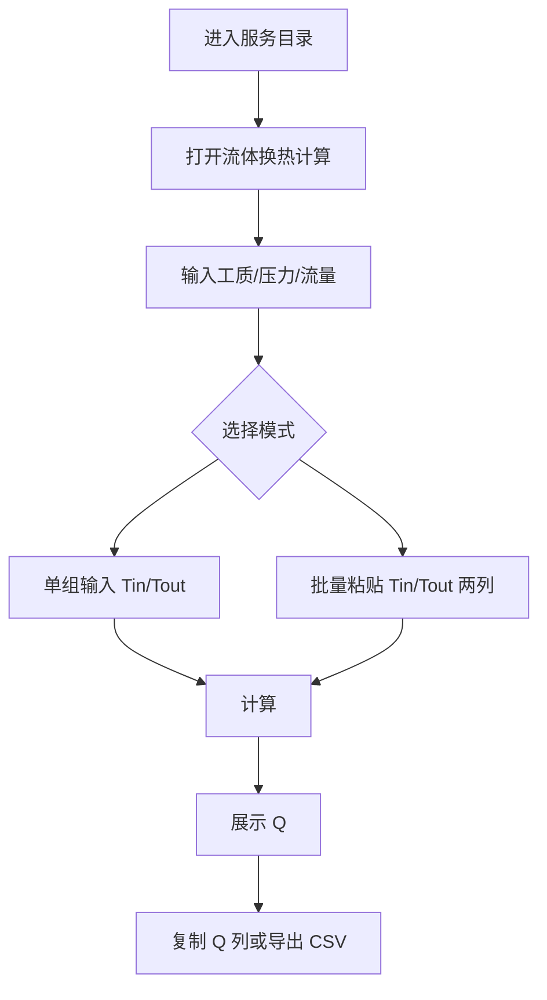

# **数据中心流体换热计算器 产品需求文档 (PRD)**

**文档状态：** 草稿  
**版本：** v1.0  
**负责人：** 待定  
**日期：** 2026-04-28  

---

## **1. 项目概述 (Project Overview)**

* **产品目标：** 提供一个轻量、快速的数据中心流体换热计算工具，帮助大噜在笔记本上处理实验数据时，通过工质、压力、流量、入口温度和出口温度快速计算换热量。
* **核心价值：** 减少实验数据处理时手动查表、手动换算和重复计算的时间成本；依赖 CoolProp 物性库进行焓值计算，降低忽略比热容温度依赖带来的误差。
* **目标用户：** 热力学、数据中心散热、液冷实验方向的科研或工程人员；当前重点用户为大噜。
* **产品形态：** Windsong 服务目录中的 One-page Web App，优先服务笔记本浏览器场景。
* **成功指标：**
    * 单组计算能在一次页面操作中完成。
    * 50 组实验数据可批量计算并复制结果列。
    * 关键错误场景均有明确文案，不需要用户猜测失败原因。

## **2. 范围定义 (Scope)**

* **当前版本包含：**
    * 从服务目录进入“流体换热计算”页面。
    * 工质搜索与选择，工质来源为 CoolProp 支持清单。
    * 单组换热量计算。
    * 批量粘贴入口温度列和出口温度列，并逐行计算换热量。
    * 结果表格展示、复制 Q 列、导出 CSV。
    * 输入校验和 CoolProp 查询失败提示。

* **当前版本不包含：**
    * 用户账号、权限控制和云端同步。
    * 历史计算记录保存。
    * 物性曲线、焓值、密度等中间数据可视化。
    * 用户自定义物性库或自定义工质。
    * 多压力、多流量逐行输入。

* **依赖与假设：**
    * 物性数据依赖 CoolProp。
    * 同一批数据使用相同工质、压力和流量。
    * 温度输入默认单位为 `°C`。
    * 对体积流量单位，后续技术设计需通过密度换算为质量流量。

## **3. 用户角色与使用场景 (User Personas & Scenarios)**

* **角色 A：实验数据处理者（大噜）**
    * **目标：** 在处理实验数据时快速得到换热量结果。
    * **痛点：** 手动查表、手动换算和逐行计算耗时，且容易因为比热容温度依赖被忽略而产生误差。
    * **典型场景 1：临时估算**
        * 大噜在笔记本上查看一组实验数据，需要快速估算某一时刻或某一工况下的换热量。
        * 大噜输入工质、压力、流量、入口温度、出口温度，点击计算后立即得到换热量。
    * **典型场景 2：批量处理实验数据**
        * 大噜从 Excel、CSV、测试软件或数据采集软件中复制几十组入口温度和出口温度。
        * 入口温度和出口温度通常分别来自两列数据，数据之间可能由换行、逗号、空格或 tab 分隔。
        * 系统解析两列温度数据后逐行计算换热量，并支持复制或导出结果。

## **4. 用户流程 (User Flow)**

* **主流程：**
    1. 用户进入 Windsong 服务目录。
    2. 用户点击“流体换热计算”服务卡片。
    3. 用户选择工质，输入压力、流量和单位。
    4. 用户选择单组计算或批量计算模式。
    5. 系统校验输入并调用计算逻辑。
    6. 系统展示换热量结果。
    7. 批量模式下，用户复制 Q 列或导出 CSV。

* **异常流程：**
    * 工质无效：提示用户选择 CoolProp 支持的有效工质。
    * 压力或流量无效：提示具体字段错误。
    * 批量两列数量不一致：阻止计算并提示检查粘贴内容。
    * CoolProp 查询失败：提示温度或压力超出物性库范围。



## **5. 功能需求 (Functional Requirements)**

| ID | 功能名称 | 用户故事/需求描述 | 优先级 | 备注 |
| :--- | :--- | :--- | :--- | :--- |
| F01 | 服务目录入口 | 作为用户，我希望能从服务目录看到“流体换热计算”入口，并点击进入工具页面。 | P0 | 入口位于 `Services.vue` |
| F02 | 工质搜索与选择 | 作为用户，我希望输入字符时能搜索 CoolProp 支持的工质，并从候选项中选择有效工质。 | P0 | 工质必须来自 CoolProp 支持清单 |
| F03 | 统一工况参数输入 | 作为用户，我希望输入一次压力和流量，并选择单位，使同一批数据使用相同工况参数。 | P0 | 压力、流量对整批数据相同 |
| F04 | 单组温度输入 | 作为用户，我希望输入单组入口温度和出口温度，用于快速临时估算。 | P0 | 温度默认 `°C` |
| F05 | 批量温度粘贴 | 作为用户，我希望分别粘贴入口温度列和出口温度列，系统能识别换行、逗号、空格和 tab。 | P0 | 两列数量必须一致 |
| F06 | 换热量计算 | 作为用户，我希望系统基于 CoolProp 焓值差计算单组或批量换热量。 | P0 | 不使用固定平均比热容近似 |
| F07 | 结果表格 | 作为用户，我希望批量结果以表格展示，包含序号、入口温度、出口温度和换热量。 | P0 | 单组模式突出显示一个结果 |
| F08 | 复制结果列 | 作为用户，我希望一键复制换热量结果列，便于粘贴回 Excel 或测试数据表。 | P0 | 一行一个结果 |
| F09 | 导出结果 | 作为用户，我希望将批量结果导出为 CSV 文件。 | P1 | 至少包含 `index,Tin_C,Tout_C,Q_W` |
| F10 | 输入校验与错误提示 | 作为用户，我希望输入错误时看到明确提示，知道如何修正。 | P0 | 文案见业务规则 |

* **优先级定义：**
    * **P0：** 当前版本必须实现，否则产品不可用。
    * **P1：** 强烈建议实现，影响主要体验或效率。
    * **P2：** 可延后实现的增强能力。

## **6. 需求拆解与版本计划 (Requirement Breakdown & Release Plan)**

* **拆解原则：**
    * 需求包按用户可感知的能力拆分。
    * 每个需求包关联功能 ID 和验收标准 ID。
    * 技术任务在 TDD 中继续拆解，这里只描述产品交付范围。

| ID | 需求包 | 包含功能 | 用户价值 | 优先级 | 验收标准 |
| :--- | :--- | :--- | :--- | :--- | :--- |
| R01 | 服务入口与基础页面 | F01 | 用户能从服务目录进入工具 | P0 | AC01 |
| R02 | 单组快速计算 | F02, F03, F04, F06, F10 | 用户能输入一组实验数据并获得换热量 | P0 | AC02, AC08, AC09 |
| R03 | 批量数据处理 | F05, F06, F07, F10 | 用户能粘贴两列实验温度并获得逐行结果 | P0 | AC03, AC04, AC07, AC09 |
| R04 | 结果复用 | F08, F09 | 用户能把结果带回 Excel、CSV 或测试软件 | P0/P1 | AC05, AC06 |
| R05 | 体验增强 | F02, F10 | 用户能更快选择常用工质并理解错误原因 | P1 | AC07, AC08 |

* **版本计划：**
    * **v1.0：** R01、R02、R03、R04。
    * **v1.1：** R05、最近一次输入本地缓存、常用工质排序优化。
    * **暂不排期：** 物性曲线、中间焓值展示、历史记录、多工况逐行输入。

## **7. 业务规则与逻辑 (Business Rules & Logic)**

* **核心计算公式：**

$$
Q = \dot{m} \times (h_{out} - h_{in})
$$

* **批量计算公式：**

$$
Q_i = \dot{m} \times (h(T_{out,i}, P) - h(T_{in,i}, P))
$$

* **变量说明：**
    * $Q$：换热量，默认显示单位为 `W`，可辅助显示 `kW`。
    * $\dot{m}$：质量流量，内部统一换算为 `kg/s`。
    * $h_{in}$：入口状态比焓，由 CoolProp 根据工质、压力和入口温度查询得到。
    * $h_{out}$：出口状态比焓，由 CoolProp 根据工质、压力和出口温度查询得到。

* **核心规则：**
    * 对 CoolProp 支持的工质，统一使用比焓差计算换热量。
    * 压力、流量和工质在一次批量计算中保持一致。
    * 批量模式下，第 `i` 个入口温度与第 `i` 个出口温度配对计算。
    * 如果 $T_{in} = T_{out}$，该行换热量为 `0`。

* **状态流转：**

| 状态 | 触发条件 | 下一状态 | 用户可见反馈 |
| :--- | :--- | :--- | :--- |
| `empty` | 页面首次进入 | `editing` | 展示空表单 |
| `editing` | 用户输入参数 | `ready` 或 `invalid` | 显示可计算状态或错误提示 |
| `ready` | 点击计算 | `calculating` | 计算按钮进入加载态 |
| `calculating` | 计算成功 | `success` | 展示结果 |
| `calculating` | 计算失败 | `error` | 展示错误文案 |

* **数据边界与校验：**
    * 工质：必须来自 CoolProp 支持清单。
    * 压力：必须大于 `0`。
    * 流量：必须大于或等于 `0`。
    * 温度：必须可解析为有限数字。
    * 批量入口温度数量必须等于出口温度数量。
    * 批量数据必须至少 1 行。

* **错误文案：**
    * 流量为负数：“流量不能为负数”。
    * 压力小于或等于 0：“压力必须大于 0”。
    * 无效工质：“请选择 CoolProp 支持的有效工质”。
    * 两列数量不一致：“入口温度和出口温度的数据数量不一致，请检查粘贴内容”。
    * 温度无法解析：“第 X 行温度数据无法识别，请检查输入格式”。
    * CoolProp 查询失败：“抱歉，当前温度或压力超出了该工质的物性库数据范围”。

## **8. 用户界面与交互 (UI/UX)**

* **信息架构：**
    * 服务目录页：新增“流体换热计算”服务卡片。
    * 工具页统一参数区：工质、压力、压力单位、流量、流量单位。
    * 输入模式区：支持“单组计算”和“批量计算”两个模式。
    * 结果区：单组模式显示主要换热量结果；批量模式显示结果表格。

* **关键交互：**
    * 工质输入使用搜索框和下拉建议，必须选择有效工质。
    * 单组模式输入入口温度和出口温度，点击“计算”后显示换热量。
    * 批量模式提供“入口温度列”和“出口温度列”两个多行文本框。
    * 批量解析后显示识别到的数据行数。
    * 批量结果提供“复制 Q 列”和“导出 CSV”按钮。

* **视觉与可用性要求：**
    * 页面采用单页工具布局，优先适配笔记本浏览器。
    * 不强制展示中间焓值，避免干扰快速估算和数据处理。
    * 结果表格至少包含：序号、入口温度、出口温度、换热量。
    * 批量错误应尽量标明具体行号。

* **文案要求：**
    * 服务卡片标题：“流体换热计算”。
    * 批量输入框：“入口温度列”“出口温度列”。
    * 操作按钮：“计算”“复制 Q 列”“导出 CSV”。

## **9. 数据需求 (Data Requirements)**

* **输入数据：**
    * 工质名称：字符串，来自 CoolProp 工质列表。
    * 压力：数值和单位，单位包含 `Pa`、`kPa`、`MPa`、`bar`。
    * 流量：数值和单位，单位包含 `kg/s`、`L/min`、`m³/h`。
    * 温度：入口/出口温度，默认单位 `°C`。

* **输出数据：**
    * 单组模式输出换热量 $Q$。
    * 批量模式输出每一行的换热量 $Q_i$。
    * CSV 导出至少包含：`index`、`Tin_C`、`Tout_C`、`Q_W`。

* **数据源：**
    * 用户输入。
    * CoolProp 物性库。

* **存储需求：**
    * v1.0 不要求账号系统和云端保存。
    * P1 可在浏览器本地临时保留最近一次输入。

* **接口或文件格式（如适用）：**
    * 建议计算输入：

```json
{
  "fluid": "Water",
  "pressure": {
    "value": 101.325,
    "unit": "kPa"
  },
  "flowRate": {
    "value": 0.1,
    "unit": "kg/s"
  },
  "rows": [
    {
      "tinC": 25.0,
      "toutC": 35.0
    }
  ]
}
```

    * 建议计算输出：

```json
{
  "unit": "W",
  "results": [
    {
      "index": 1,
      "tinC": 25.0,
      "toutC": 35.0,
      "qW": 4180.0
    }
  ]
}
```

* **数据隐私与合规（如适用）：**
    * 用户输入仅用于计算。
    * 不长期保存实验数据。
    * 日志不应记录完整批量温度列。

## **10. 非功能性需求 (Non-Functional Requirements)**

* **性能：**
    * 单组计算响应时间目标小于 `1s`。
    * 50 组批量计算响应时间目标小于 `3s`。
* **兼容性：**
    * 优先支持笔记本浏览器，包括最新版 Chrome、Edge、Firefox。
    * 页面宽度在常见 13-16 英寸笔记本屏幕上应可舒适使用。
* **可靠性：**
    * CoolProp 查询失败时应返回可理解的业务错误。
    * 批量计算中错误行应尽量可定位。
* **安全性：**
    * v1.0 不涉及用户账号和敏感数据上传。
    * 需限制异常大批量输入，避免过大请求影响服务。
* **可用性：**
    * 支持直接从 Excel、CSV、测试软件中复制粘贴数据。
    * 结果列复制后应保持一行一个换热量。
* **可维护性：**
    * CoolProp 查询和单位换算必须在后端或共享工具函数中统一实现，避免前后端计算口径不一致。

## **11. 验收标准 (Acceptance Criteria)**

| ID | 场景 | 前置条件 | 操作步骤 | 预期结果 |
| :--- | :--- | :--- | :--- | :--- |
| AC01 | 服务入口 | 用户打开服务目录 | 点击“流体换热计算”卡片 | 进入换热计算工具页 |
| AC02 | 单组计算 | 已选择有效工质，压力和流量合法 | 输入一组入口/出口温度并点击计算 | 系统显示一个换热量结果 |
| AC03 | 批量列粘贴 | 已选择有效工质，压力和流量合法 | 入口框粘贴 `25.1 25.2 25.3`，出口框粘贴 `30.1 30.2 30.3` 后计算 | 系统展示 3 行结果，每行包含入口温度、出口温度和换热量 |
| AC04 | 不同分隔符解析 | 处于批量模式 | 使用换行、逗号、空格或 tab 分隔温度数据 | 系统均能正确解析为温度数组 |
| AC05 | 复制结果列 | 批量计算完成 | 点击“复制 Q 列” | 剪贴板内容为一列换热量数值，每个结果占一行 |
| AC06 | 导出 CSV | 批量计算完成 | 点击“导出 CSV” | 导出的文件至少包含 `index`、`Tin_C`、`Tout_C`、`Q_W` 四列 |
| AC07 | 输入数量不一致 | 入口温度解析出 3 个数值，出口温度解析出 2 个数值 | 点击计算 | 系统禁止计算，并提示“入口温度和出口温度的数据数量不一致，请检查粘贴内容” |
| AC08 | 非法参数拦截 | 用户输入非法参数 | 输入非正压力、负数流量或无效工质 | 系统分别提示“压力必须大于 0”“流量不能为负数”“请选择 CoolProp 支持的有效工质” |
| AC09 | 物性库范围错误 | 温度或压力超出 CoolProp 支持范围 | 点击计算 | 系统提示“抱歉，当前温度或压力超出了该工质的物性库数据范围” |

* **完成定义 (Definition of Done)：**
    * P0 功能全部完成。
    * 核心验收用例通过。
    * 关键错误场景有明确处理。
    * PRD、TDD、依赖和运行说明保持一致。

## **12. 开放问题与后续规划 (Open Questions & Future Work)**

* **开放问题：**
    * 是否需要在 UI 中展示 `Q` 的正负方向解释，例如“正值表示出口焓高于入口焓”。
    * 是否需要限制或推荐常用工质优先排序，例如 `Water`、`Air`、常见制冷剂。

* **后续规划：**
    * 最近一次输入本地缓存。
    * 常用工质优先排序。
    * 可选展示中间焓值和密度。
    * 更大批量数据的异步计算或任务化处理。
