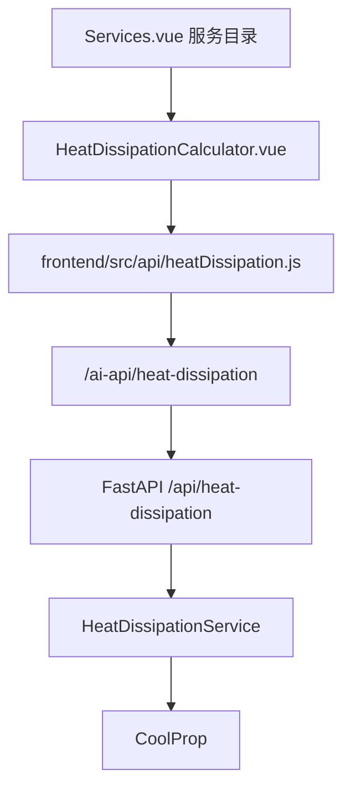
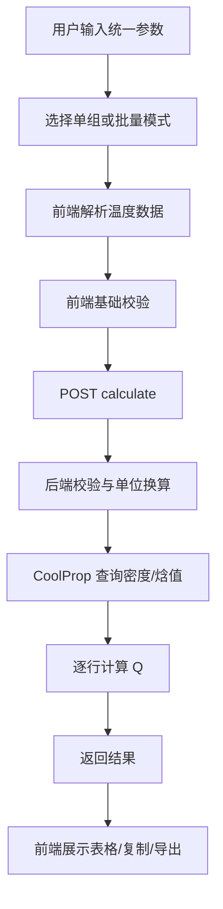

# **数据中心流体换热计算器 技术设计文档 (TDD)**

**关联 PRD：** [docs/heat-dissipation-calculator/prd.md](./prd.md)  
**文档状态：** 草稿  
**版本：** v1.0  
**架构师/负责人：** 待定  
**最后更新：** 2026-04-28  

---

## **1. 系统架构预览 (System Architecture)**

* **项目类型：** 现有 Windsong 项目中的 One-page Web App 服务页。
* **技术栈 (Tech Stack)：**
    * **前端：** Vue 3 + Vue Router + Vite + Axios。
    * **后端：** `ai-service` FastAPI。
    * **数据存储：** v1.0 不需要数据库；可选使用浏览器 `localStorage` 临时保存最近一次输入。
    * **第三方依赖：** CoolProp Python 包。
    * **运行环境：** 前端浏览器；后端 Python 服务；开发环境通过 Vite `/ai-api` 代理访问 FastAPI `/api`。

* **架构说明：**
    * 在 [frontend/src/views/Services.vue](../../frontend/src/views/Services.vue) 中新增“流体换热计算”服务卡片，入口指向 `/services/heat-dissipation-calculator`。
    * 前端新增 Vue 页面，负责参数输入、批量粘贴解析前预览、结果表格展示、复制 Q 列和导出 CSV。
    * 前端通过 `frontend/src/api/heatDissipation.js` 调用 `ai-service` 的 FastAPI 接口。
    * 后端在 `ai-service` 中新增计算服务，封装 CoolProp 的工质列表、焓值查询、密度查询、单位换算和批量计算。
    * 该功能不接入登录鉴权，不写入数据库。

* **总体架构图：**



## **2. 数据模型与状态设计 (Data Model & State)**

* **核心数据对象：**

| 对象 | 字段 | 类型 | 必填 | 说明 |
| :--- | :--- | :--- | :--- | :--- |
| `UnitValue` | `value` | `number` | 是 | 用户输入的数值 |
| `UnitValue` | `unit` | `string` | 是 | 用户选择的单位 |
| `TemperatureRowInput` | `tinC` | `number` | 是 | 入口温度，单位 `°C` |
| `TemperatureRowInput` | `toutC` | `number` | 是 | 出口温度，单位 `°C` |
| `HeatDissipationRequest` | `fluid` | `string` | 是 | CoolProp 工质名 |
| `HeatDissipationRequest` | `pressure` | `UnitValue` | 是 | 压力输入 |
| `HeatDissipationRequest` | `flowRate` | `UnitValue` | 是 | 流量输入 |
| `HeatDissipationRequest` | `rows` | `TemperatureRowInput[]` | 是 | 单组或批量温度行 |
| `HeatDissipationResultRow` | `index` | `number` | 是 | 从 1 开始的行号 |
| `HeatDissipationResultRow` | `tinC` | `number` | 是 | 入口温度 |
| `HeatDissipationResultRow` | `toutC` | `number` | 是 | 出口温度 |
| `HeatDissipationResultRow` | `qW` | `number` | 是 | 换热量，单位 `W` |
| `HeatDissipationResultRow` | `qDisplay` | `string` | 是 | 前端展示值，例如 `4.18 kW` |

* **前端状态模型：**
    * `mode`：`single` 或 `batch`。
    * `fluidQuery`：工质搜索输入。
    * `selectedFluid`：用户从候选项中确认的工质。
    * `pressureValue`、`pressureUnit`：压力输入。
    * `flowValue`、`flowUnit`：流量输入。
    * `singleTinC`、`singleToutC`：单组模式温度输入。
    * `batchTinText`、`batchToutText`：批量模式粘贴文本。
    * `parsedRows`：前端解析后的温度行。
    * `results`：后端返回的计算结果。
    * `isLoading`、`errorMessage`、`rowCount`：加载、错误和解析反馈。

* **本地缓存：**
    * P1：使用 `localStorage` 保存最近一次工质、压力、压力单位、流量、流量单位和输入模式。
    * 不保存计算历史，不上传或持久化用户实验数据。

* **数据库/持久化设计：**
    * v1.0 不新增数据库表。

* **导入/导出格式：**
    * 批量导入：两个多行文本框，分别粘贴入口温度列和出口温度列。
    * 支持分隔符：换行、英文逗号、空格、tab。
    * CSV 导出字段：`index,Tin_C,Tout_C,Q_W`。
    * 复制 Q 列格式：一行一个 `Q_W` 数值。

## **3. API 与接口设计 (API & Interfaces)**

### **3.1 获取工质列表**

* **类型：** HTTP API
* **前端调用：** `GET /ai-api/heat-dissipation/fluids?query=water`
* **后端接口：** `GET /api/heat-dissipation/fluids`
* **说明：** 用于工质搜索下拉建议；`query` 为空时返回常用工质或前 N 个工质。

* **Response:**

```json
{
  "items": [
    {
      "name": "Water",
      "aliases": ["water", "H2O"]
    }
  ]
}
```

### **3.2 计算换热量**

* **类型：** HTTP API
* **前端调用：** `POST /ai-api/heat-dissipation/calculate`
* **后端接口：** `POST /api/heat-dissipation/calculate`
* **鉴权：** 无。

* **Request/Input:**

```json
{
  "fluid": "Water",
  "pressure": {
    "value": 101.325,
    "unit": "kPa"
  },
  "flowRate": {
    "value": 0.1,
    "unit": "kg/s"
  },
  "rows": [
    {
      "tinC": 25.0,
      "toutC": 35.0
    }
  ]
}
```

* **Response/Output:**

```json
{
  "unit": "W",
  "results": [
    {
      "index": 1,
      "tinC": 25.0,
      "toutC": 35.0,
      "qW": 4180.0,
      "qDisplay": "4.18 kW"
    }
  ]
}
```

* **错误定义：**

| 错误码/类型 | HTTP 状态 | 触发条件 | 返回信息 | 处理方式 |
| :--- | :--- | :--- | :--- | :--- |
| `INVALID_FLUID` | 400 | 工质不在 CoolProp 支持列表中 | 请选择 CoolProp 支持的有效工质 | 前端展示错误 |
| `INVALID_PRESSURE` | 400 | 压力小于或等于 0 | 压力必须大于 0 | 前端定位压力输入 |
| `INVALID_FLOW_RATE` | 400 | 流量为负数 | 流量不能为负数 | 前端定位流量输入 |
| `INVALID_ROWS` | 400 | `rows` 为空或超过限制 | 请至少输入一组温度数据 | 前端提示输入温度 |
| `PROPERTY_RANGE_ERROR` | 400 | CoolProp 查询失败或超出物性范围 | 抱歉，当前温度或压力超出了该工质的物性库数据范围 | 前端展示错误，可标识行号 |
| `INTERNAL_ERROR` | 500 | 未预期服务端错误 | 换热量计算失败，请稍后重试 | 前端展示通用错误 |

### **3.3 前端 API 模块**

* 新增 `frontend/src/api/heatDissipation.js`：
    * `searchHeatDissipationFluids(query)`
    * `calculateHeatDissipation(payload)`
* 使用独立 Axios 实例，`baseURL: '/ai-api'`，与 [frontend/src/api/valuation.js](../../frontend/src/api/valuation.js) 保持一致。

## **4. 核心逻辑与算法设计 (Core Logic & Algorithms)**

* **核心流程：**



* **计算公式：**

$$
Q_i = \dot{m}_i \times (h(T_{out,i}, P) - h(T_{in,i}, P))
$$

* **单位归一化：**
    * 压力统一换算为 `Pa`：
        * `Pa`：`value`
        * `kPa`：`value * 1000`
        * `MPa`：`value * 1000000`
        * `bar`：`value * 100000`
    * 温度统一换算为 `K`：`T_K = T_C + 273.15`。
    * 质量流量统一换算为 `kg/s`：
        * `kg/s`：直接使用。
        * `L/min`：先换算体积流量 `m3/s = value / 1000 / 60`，再乘以密度。
        * `m³/h`：先换算体积流量 `m3/s = value / 3600`，再乘以密度。

* **体积流量密度换算：**
    * 体积流量转换为质量流量时，需要查询密度 `rho`。
    * 密度查询使用同一工质、压力和该行入口温度：

$$
\dot{m}_i = \rho(T_{in,i}, P) \times \dot{V}
$$

    * 因此，体积流量模式下每一行可能得到不同质量流量；`kg/s` 模式下所有行质量流量相同。

* **后端伪代码：**

```text
validate_request(payload)
fluid = normalize_fluid(payload.fluid)
pressure_pa = convert_pressure_to_pa(payload.pressure)

for row in payload.rows:
    tin_k = row.tinC + 273.15
    tout_k = row.toutC + 273.15

    if payload.flowRate.unit == "kg/s":
        mass_flow = payload.flowRate.value
    else:
        rho = coolprop_density(fluid, tin_k, pressure_pa)
        volume_flow = convert_volume_flow_to_m3_per_s(payload.flowRate)
        mass_flow = rho * volume_flow

    h_in = coolprop_enthalpy(fluid, tin_k, pressure_pa)
    h_out = coolprop_enthalpy(fluid, tout_k, pressure_pa)
    q_w = mass_flow * (h_out - h_in)
    append_result(row, q_w)

return results
```

* **前端批量解析规则：**
    * `parseNumberList(text)` 使用正则 `/[\s,]+/` 分割。
    * 空字符串忽略。
    * 每个 token 必须能转换为有限数字。
    * 入口温度数组和出口温度数组长度必须一致。
    * 配对后生成 `rows: [{ tinC, toutC }]`。

* **边界条件：**
    * `Tin = Tout`：后端正常返回该行 `qW = 0`。
    * 负数换热量：允许，表示按当前进出口温度方向为放热/吸热的相反方向；前端不拦截。
    * 压力 `<= 0`：前后端都拦截。
    * 流量 `< 0`：前后端都拦截；流量 `= 0` 允许，结果为 `0`。
    * 批量行数：v1.0 建议限制 `1-500` 行，超过时提示减少数据量，避免单次 CoolProp 调用过长。
    * CoolProp 异常：后端捕获并转换为业务错误，避免暴露 Python 栈。

## **5. 模块详细设计 (Component Detail)**

| 模块 | 职责 | 输入 | 输出 | 依赖 |
| :--- | :--- | :--- | :--- | :--- |
| `Services.vue` | 服务目录入口 | 服务配置数组 | 服务卡片 | Vue Router |
| `HeatDissipationCalculator.vue` | 页面主体、输入、结果、复制、导出 | 用户输入、API 返回 | UI 状态与结果表格 | `heatDissipation.js` |
| `heatDissipation.js` | 前端 API 封装 | 查询参数、计算 payload | Axios response | Axios |
| `HeatDissipationService` | 后端计算服务 | Pydantic request | 计算结果 | CoolProp |
| `models.heat_dissipation` | 请求/响应模型 | JSON | Pydantic 模型 | Pydantic |

* **前端新增/修改文件：**
    * 修改 [frontend/src/views/Services.vue](../../frontend/src/views/Services.vue)：新增服务卡片：
        * `slug: 'heat-dissipation-calculator'`
        * `to: '/services/heat-dissipation-calculator'`
        * `kind: 'Thermal'`
        * `title: '流体换热计算'`
    * 修改 [frontend/src/router/index.js](../../frontend/src/router/index.js)：新增路由：
        * `path: '/services/heat-dissipation-calculator'`
        * `name: 'HeatDissipationCalculator'`
        * `component: HeatDissipationCalculator`
    * 新增 `frontend/src/views/HeatDissipationCalculator.vue`。
    * 新增 `frontend/src/api/heatDissipation.js`。

* **后端新增/修改文件：**
    * 修改 [ai-service/requirements.txt](../../ai-service/requirements.txt)：新增 `CoolProp`。
    * 新增 `ai-service/models/heat_dissipation.py`：定义 Pydantic 请求/响应模型。
    * 新增 `ai-service/services/heat_dissipation.py`：封装 CoolProp 和单位换算。
    * 修改 [ai-service/main.py](../../ai-service/main.py)：挂载 `/api/heat-dissipation/fluids` 和 `/api/heat-dissipation/calculate`。

* **错误处理策略：**
    * 前端基础错误在提交前拦截，例如空输入、非数字、两列数量不一致。
    * 后端重新校验所有业务输入，作为最终防线。
    * 后端返回 `HTTPException(status_code=400, detail={ "code": "...", "message": "...", "rowIndex": 3 })`。
    * 前端优先展示 `detail.message`，如包含 `rowIndex`，在结果或提示中标明具体行。

## **6. 非功能性方案 (Non-Functional Implementation)**

* **性能：**
    * 单组计算目标响应时间 `< 1s`。
    * 50 组批量计算目标响应时间 `< 3s`。
    * 后端对工质列表可做进程内缓存。
    * 同一次请求中，压力、工质、体积流量固定；但体积流量密度依赖入口温度，不应错误复用跨行密度。

* **兼容性：**
    * 支持最新版 Chrome、Edge、Firefox。
    * 页面优先适配 13-16 英寸笔记本屏幕。
    * 移动端可基本可用，但不是 v1.0 主要优化目标。

* **安全性：**
    * 不需要登录和管理员 API Key。
    * 后端限制批量行数和请求体大小，避免过大的 CoolProp 计算请求。
    * 错误响应不暴露服务器路径、栈信息或依赖内部异常。

* **可靠性与可观测性：**
    * 后端复用现有 `RequestLoggingMiddleware`，记录路径、状态码和延迟。
    * 计算失败时记录结构化日志：`fluid`、`pressureUnit`、`flowUnit`、`row_count`、错误类型；不记录完整实验数据列。
    * CoolProp 未安装或初始化失败时，`/health` 仍可返回服务状态，但计算接口返回明确 500 错误。

## **7. 测试与验证方案 (Testing & Validation)**

* **单元测试：**
    * `parseNumberList`：覆盖换行、逗号、空格、tab、混合分隔符、非法 token。
    * 单位换算：`Pa/kPa/MPa/bar`、`kg/s/L/min/m³/h`。
    * `Tin = Tout` 返回 `0`。
    * 负数流量、非正压力、空 rows、超过行数限制。

* **后端集成测试：**
    * `GET /api/heat-dissipation/fluids` 能返回 CoolProp 工质。
    * `POST /api/heat-dissipation/calculate` 使用 `Water`、`kg/s`、单组温度返回结果。
    * 使用 `L/min` 或 `m³/h` 时会调用密度换算。
    * 非法工质返回 `INVALID_FLUID`。
    * 超出物性范围返回 `PROPERTY_RANGE_ERROR`。

* **前端端到端测试（如引入 E2E）：**
    * 从服务目录点击“流体换热计算”进入页面。
    * 单组输入后显示一个换热量结果。
    * 批量粘贴两列 3 行数据后显示 3 行表格。
    * 点击“复制 Q 列”后剪贴板是一列结果。
    * 点击“导出 CSV”后生成包含 `index,Tin_C,Tout_C,Q_W` 的文件。

* **基准数据/验算方式：**
    * 使用 CoolProp 在测试中直接计算基准值，断言接口输出与服务内部公式一致。
    * 对固定样例可采用 `pytest.approx`，允许浮点误差 `1e-6` 或业务展示层误差 `0.01 W`。
    * 不使用手写固定比热容结果作为后端精度基准。

## **8. 开发任务拆解 (Implementation Plan)**

* **拆解原则：**
    * 优先实现后端最小计算闭环，再接前端页面。
    * CoolProp、单位换算、批量解析和错误处理优先配套测试。
    * 每个任务结束时都应能通过测试、构建或手动验证证明可用。
    * 每轮任务只处理表中范围，不顺手扩展历史记录、登录、图表或物性曲线。

| ID | 任务 | 对应需求 | 范围 | 依赖 | 验收方式 |
| :--- | :--- | :--- | :--- | :--- | :--- |
| T01 | 后端依赖与计算服务骨架 | R02, R03 / F06 / AC02, AC03 | 在 `ai-service` 增加 `CoolProp` 依赖、Pydantic 模型、`HeatDissipationService` 骨架；实现压力/温度/流量单位换算函数 | 无 | 后端单元测试覆盖单位换算；`pip install -r requirements.txt` 成功 |
| T02 | 最小计算接口 | R02 / F03, F04, F06, F10 / AC02, AC08 | 实现 `POST /api/heat-dissipation/calculate`，先支持 `Water + kg/s + 单组 rows` | T01 | 使用 FastAPI 测试客户端或手动请求可返回 `qW`；非法压力/负数流量返回 400 |
| T03 | 批量计算与体积流量 | R03 / F05, F06, F07 / AC03, AC04 | 支持多行 `rows`，支持 `L/min`、`m³/h` 通过入口温度密度逐行换算质量流量 | T02 | 后端测试覆盖 3 行批量、体积流量密度换算、`Tin = Tout` |
| T04 | 工质搜索接口 | R02, R05 / F02, F10 / AC08 | 实现 `GET /api/heat-dissipation/fluids`，从 CoolProp 工质列表过滤候选项 | T01 | 查询 `water` 能返回 `Water`；空查询返回有限数量候选项 |
| T05 | 前端入口与路由 | R01 / F01 / AC01 | 修改 `Services.vue` 新增“流体换热计算”卡片；修改 router 新增 `/services/heat-dissipation-calculator` | 无 | 前端启动后可从服务目录进入新页面骨架 |
| T06 | 前端页面单组计算 | R02 / F02, F03, F04, F06, F10 / AC02, AC08 | 新增 `HeatDissipationCalculator.vue` 和 `heatDissipation.js`；实现统一参数输入、单组温度输入、提交计算、显示结果 | T02、T05 | 手动输入一组数据后页面显示换热量；`npm run build` 通过 |
| T07 | 前端批量粘贴与结果表格 | R03 / F05, F07, F10 / AC03, AC04, AC07 | 实现两个批量文本框、`parseNumberList`、两列配对、行数提示、结果表格 | T03、T06 | 粘贴 3 组入口/出口温度后显示 3 行 `Tin/Tout/Q` |
| T08 | 复制 Q 列与导出 CSV | R04 / F08, F09 / AC05, AC06 | 实现 Clipboard API 复制结果列、CSV 文件导出和失败兜底提示 | T07 | 复制内容为一行一个 `Q_W`；导出 CSV 包含 `index,Tin_C,Tout_C,Q_W` |
| T09 | 错误态与体验打磨 | R02, R03, R05 / F10 / AC07, AC08, AC09 | 对齐 PRD 错误文案；处理无效工质、两列数量不一致、CoolProp 查询失败、超出行数限制 | T04、T07 | PRD 验收标准中的异常用例均有明确提示 |

* **推荐开发循环：**
    1. 选择一个任务 ID，明确本轮只做该任务范围。
    2. 对后端计算、单位换算、解析逻辑先写或补测试。
    3. 实现最小可用功能。
    4. 运行相关测试；涉及前端时运行 `npm run build`。
    5. 对照 PRD/TDD 检查是否新增了范围外能力。

* **适合测试驱动的部分：**
    * 压力单位换算。
    * 体积流量到质量流量的换算。
    * 批量文本解析和两列配对。
    * 后端输入校验和错误码。
    * CoolProp 查询失败的异常转换。

* **适合手动或端到端验证的部分：**
    * 服务目录卡片跳转。
    * 单组计算表单交互。
    * 批量粘贴、结果表格展示。
    * 剪贴板复制和 CSV 下载。

## **9. 部署与环境 (Infrastructure & DevOps)**

* **本地开发：**
    * 前端安装依赖：`cd frontend && npm install`
    * 前端启动：`cd frontend && npm run dev`
    * 后端安装依赖：`cd ai-service && pip install -r requirements.txt`
    * 后端启动：`cd ai-service && uvicorn main:app --reload --host 0.0.0.0 --port 8000`

* **配置管理：**
    * 本功能不新增环境变量。
    * 依赖 Vite 已有 `/ai-api` 代理配置，将请求转发到 `http://localhost:8000/api`。

* **构建与部署：**
    * 前端构建：`cd frontend && npm run build`
    * 后端 Docker 镜像需确保 `CoolProp` 能在目标环境安装成功。
    * 若生产环境通过 Nginx 代理 `/ai-api`，需保持与开发环境一致的路径重写规则。

## **10. 风险预估与备选方案 (Risks & Alternatives)**

| 风险 | 影响 | 概率 | 应对方案 | 备选方案 |
| :--- | :--- | :--- | :--- | :--- |
| CoolProp 安装失败或平台 wheel 不兼容 | 高 | 中 | 在 `ai-service` Docker 构建阶段验证安装；锁定可用版本 | 使用可安装平台镜像或改为单独计算服务 |
| CoolProp 对某些工质/状态点查询失败 | 中 | 中 | 捕获异常并返回 PRD 指定文案 | 在 UI 中提示用户调整压力/温度 |
| 批量行数过多导致响应慢 | 中 | 中 | 限制 v1.0 单次最多 500 行 | 后续改为异步任务或 Web Worker/后台任务 |
| 体积流量转质量流量的密度口径被误解 | 中 | 中 | TDD 明确使用入口温度密度逐行换算 | 后续增加用户可选密度输入 |
| 前端复制剪贴板受浏览器权限限制 | 低 | 中 | 使用 Clipboard API，失败时展示可手动复制文本框 | 提供下载 CSV 作为替代 |

* **暂不实现的内容：**
    * 不保存历史计算记录。
    * 不提供账号、权限和云端同步。
    * 不展示中间焓值、密度或物性曲线。
    * 不支持用户自定义物性数据源。

* **开放问题：**
    * 是否需要在 UI 中展示 `Q` 的正负方向解释，例如“正值表示出口焓高于入口焓”。
    * 是否需要限制或推荐常用工质优先排序，例如 `Water`、`Air`、常见制冷剂。
