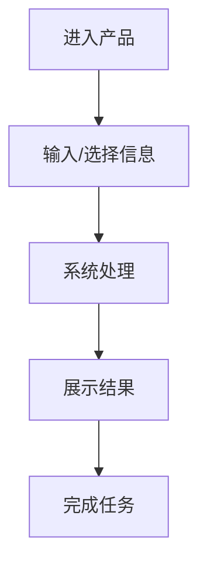

# **[项目名称] 产品需求文档 (PRD)**

**文档状态：** [草稿 / 评审中 / 已通过 / 已归档]  
**版本：** v1.0  
**负责人：** [负责人]  
**日期：** 202X-XX-XX  

---

## **1. 项目概述 (Project Overview)**
> **AI 开发提示：** 这一部分定义产品的目标、边界和价值。请用具体场景和用户问题描述产品，不要只写抽象愿景。

* **产品目标：** [一句话说明产品要解决的核心问题]
* **核心价值：** [为什么值得做；带来什么效率、体验、收入、质量或成本收益]
* **目标用户：** [谁会使用；他们的角色、能力水平、使用环境]
* **产品形态：** [如：网页应用 / 移动 App / 后台系统 / CLI 工具 / 插件 / API 服务]
* **成功指标：** [如：完成时间降低 X%、转化率提升 X%、错误率低于 X%、用户满意度等]

## **2. 范围定义 (Scope)**
> **写什么：** 明确当前版本做什么、不做什么，防止实现时范围膨胀。

* **当前版本包含：**
    * [能力 1]
    * [能力 2]
    * [能力 3]

* **当前版本不包含：**
    * [暂不实现的能力 1]
    * [暂不实现的能力 2]

* **依赖与假设：**
    * [依赖的外部服务、数据源、设备、权限或人工流程]
    * [产品成立的关键假设]

## **3. 用户角色与使用场景 (User Personas & Scenarios)**
> **写什么：** 描述真实用户在什么情况下会打开产品、要完成什么任务、当时有什么限制。

* **角色 A：** [角色名称]
    * **目标：** [用户想完成什么]
    * **痛点：** [现在为什么麻烦、慢、容易错或不可控]
    * **典型场景：** [用 2-4 句话描述一次真实使用过程]

* **角色 B（如适用）：** [角色名称]
    * **目标：** [用户想完成什么]
    * **痛点：** [当前问题]
    * **典型场景：** [真实使用过程]

## **4. 用户流程 (User Flow)**
> **写什么：** 用步骤或流程图描述用户从进入产品到完成目标的路径。

* **主流程：**
    1. [用户进入产品/页面]
    2. [用户输入或选择关键信息]
    3. [系统处理并反馈]
    4. [用户确认、保存、导出或继续下一步]

* **异常流程：**
    * [输入错误时系统如何提示]
    * [网络/第三方服务失败时如何处理]
    * [用户取消、中断或返回时如何处理]

## **5. 功能需求 (Functional Requirements)**
> **写什么：** 这是 PRD 的核心。功能描述应说明用户行为、系统响应、约束条件和优先级。

| ID | 功能名称 | 用户故事/需求描述 | 优先级 | 备注 |
| :--- | :--- | :--- | :--- | :--- |
| F01 | [功能名称] | 作为[用户]，我希望[完成某事]，以便[获得价值]。 | P0 | [约束或说明] |
| F02 | [功能名称] | [需求描述] | P1 | [约束或说明] |
| F03 | [功能名称] | [需求描述] | P2 | [约束或说明] |

* **优先级定义：**
    * **P0：** 当前版本必须实现，否则产品不可用。
    * **P1：** 强烈建议实现，影响主要体验或效率。
    * **P2：** 可延后实现的增强能力。

## **6. 需求拆解与版本计划 (Requirement Breakdown & Release Plan)**
> **写什么：** 将功能需求拆成产品侧可交付的小范围，方便后续 TDD 继续拆成技术任务。这里关注“交付什么用户价值”，不是“怎么实现”。

* **拆解原则：**
    * 每个需求包应能被用户感知或被验收标准验证。
    * 优先按用户关键路径拆分，例如“能完成一次最小任务”优先于“先做全部底层能力”。
    * 每个需求包都应关联功能 ID 和验收标准 ID。
    * 明确本版本不做的能力，避免开发阶段范围膨胀。

| ID | 需求包 | 包含功能 | 用户价值 | 优先级 | 验收标准 |
| :--- | :--- | :--- | :--- | :--- | :--- |
| R01 | [需求包名称] | [F01, F02] | [用户获得什么能力] | P0 | [AC01, AC02] |
| R02 | [需求包名称] | [F03] | [用户获得什么能力] | P1 | [AC03] |

* **版本计划：**
    * **v1.0：** [必须交付的需求包]
    * **v1.1：** [增强体验或效率的需求包]
    * **暂不排期：** [当前不做的想法]

## **7. 业务规则与逻辑 (Business Rules & Logic)**
> **AI 开发提示：** 这里要写清楚规则、公式、权限、状态变化、边界条件和错误文案。不要让实现者自行猜测业务逻辑。

* **核心规则：**
    * 规则 1：[如果 A，则 B；否则 C]
    * 规则 2：[数据如何计算、排序、过滤、合并或展示]

* **状态流转（如适用）：**

| 状态 | 触发条件 | 下一状态 | 用户可见反馈 |
| :--- | :--- | :--- | :--- |
| `[state]` | [条件] | `[next_state]` | [提示/展示] |

* **计算公式（如适用）：**

$$
[公式]
$$

* **数据边界与校验：**
    * [字段 A]：[取值范围、格式、是否必填]
    * [字段 B]：[取值范围、格式、是否必填]

* **错误文案：**
    * [错误场景]：“[给用户看的明确文案]”

## **8. 用户界面与交互 (UI/UX)**
> **写什么：** 即使没有视觉稿，也要描述页面结构、关键控件、交互反馈和不同状态。

* **信息架构：**
    * 页面/视图 1：[包含哪些信息和操作]
    * 页面/视图 2：[包含哪些信息和操作]

* **关键交互：**
    * [点击/输入/拖拽/上传/导出等操作后的系统反馈]
    * [实时更新、手动提交、加载态、空状态、错误态]

* **视觉与可用性要求：**
    * [布局偏好、密度、响应式要求、无障碍要求]
    * [按钮、表单、表格、图表、弹窗等关键组件要求]

* **文案要求：**
    * [按钮文案、提示文案、空状态文案、成功/失败文案]

## **9. 数据需求 (Data Requirements)**
> **写什么：** 产品需要哪些输入、输出、数据来源、保存策略和数据质量要求。

* **输入数据：**
    * [字段名]：[类型、来源、是否必填、示例]

* **输出数据：**
    * [字段名]：[类型、展示方式、导出方式、示例]

* **数据源：**
    * [用户输入 / 内置数据 / 第三方 API / 数据库 / 文件上传]

* **存储需求：**
    * [是否保存、保存在哪里、保存多久、谁可以访问]

* **接口或文件格式（如适用）：**
    * [API 输入输出 / CSV 列定义 / JSON Schema / 上传文件限制]

* **数据隐私与合规（如适用）：**
    * [是否包含个人信息、敏感数据、日志脱敏、删除机制]

## **10. 非功能性需求 (Non-Functional Requirements)**
> **写什么：** 定义产品“好不好用、稳不稳定、安不安全”的可衡量标准。

* **性能：** [响应时间、吞吐量、批处理规模、页面加载时间]
* **兼容性：** [浏览器、设备、操作系统、屏幕尺寸、语言地区]
* **可靠性：** [可用性目标、失败重试、降级策略、数据一致性]
* **安全性：** [鉴权、权限、输入校验、数据加密、上传限制]
* **可用性：** [易学性、操作步数、错误可恢复、无障碍要求]
* **可维护性：** [配置化、日志、可观测性、可扩展点]

## **11. 验收标准 (Acceptance Criteria)**
> **写什么：** 告诉测试、开发和 AI，什么状态才算完成。验收标准应可验证、可复现。

| ID | 场景 | 前置条件 | 操作步骤 | 预期结果 |
| :--- | :--- | :--- | :--- | :--- |
| AC01 | [正常路径] | [前置条件] | [步骤 1；步骤 2] | [明确结果] |
| AC02 | [异常路径] | [前置条件] | [步骤 1；步骤 2] | [明确错误提示或处理结果] |

* **完成定义 (Definition of Done)：**
    * [P0 功能全部完成]
    * [核心验收用例通过]
    * [关键错误场景有明确处理]
    * [文档、配置或部署说明已更新]

## **12. 开放问题与后续规划 (Open Questions & Future Work)**
> **写什么：** 记录尚未确认的问题和后续版本可能做的能力，避免当前版本被未决事项阻塞。

* **开放问题：**
    * [问题 1：需要谁确认，什么时候确认]
    * [问题 2：需要什么数据或调研]

* **后续规划：**
    * [未来版本能力 1]
    * [未来版本能力 2]
