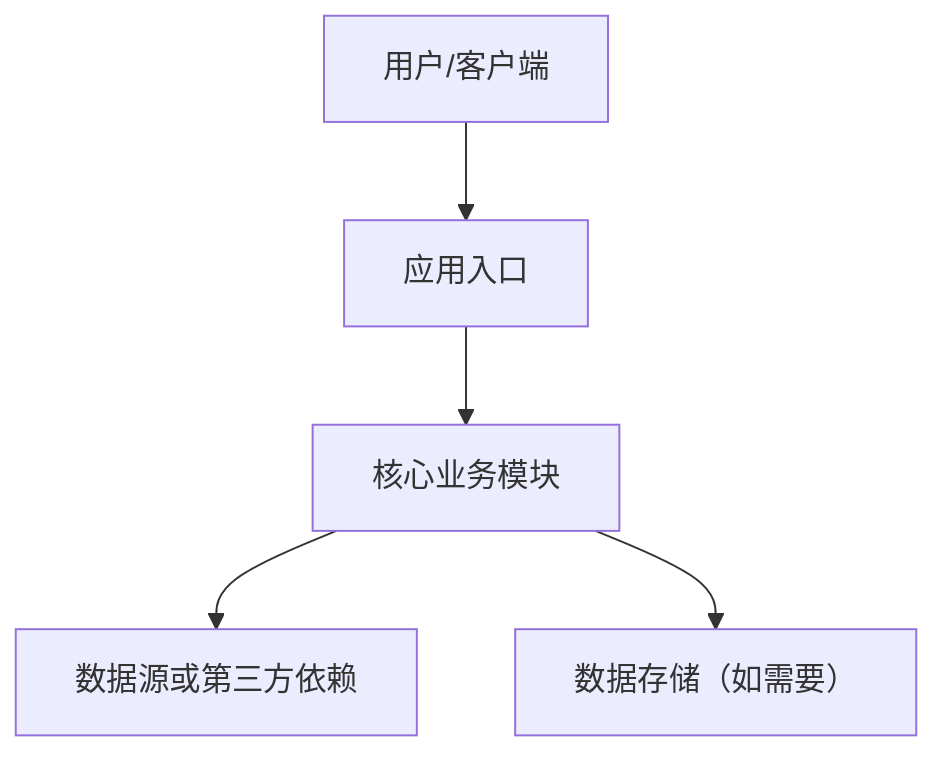
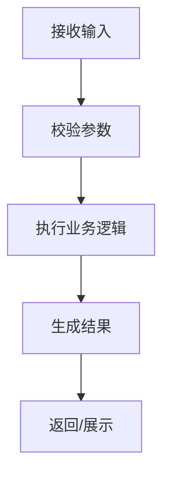

# **[项目名称] 技术设计文档 (TDD)**

**关联 PRD：** [链接到 PRD 文档]  
**文档状态：** [草稿 / 评审中 / 已通过]  
**版本：** v1.0  
**架构师/负责人：** [负责人]  
**最后更新：** 202X-XX-XX  

---

## **1. 系统架构预览 (System Architecture)**
> **AI 开发提示：** 这一部分定义系统的“骨架”。请根据项目复杂度选择合适架构，不要为了套模板引入不必要的数据库、网关、缓存或微服务。

* **项目类型：** [如：静态网页 / One-page Web App / 前后端分离应用 / 后端服务 / CLI 工具 / 移动端应用 / 桌面应用]
* **技术栈 (Tech Stack)：**
    * **前端：** [如：React, Vue, Svelte, Next.js, TailwindCSS；如无前端则填“无”]
    * **后端：** [如：Python/FastAPI, Node.js/NestJS, Go, Java Spring；如无后端则填“无”]
    * **数据存储：** [如：无 / LocalStorage / SQLite / PostgreSQL / MongoDB / 对象存储]
    * **第三方依赖：** [如：OpenAI API, CoolProp, Stripe, Mapbox]
    * **运行环境：** [如：浏览器 / Node.js / Docker / Serverless / 云服务器]
* **架构说明：** 用 3-5 句话描述主要模块如何协作。
* **总体架构图：**



## **2. 数据模型与状态设计 (Data Model & State)**
> **写什么：** 定义系统处理的数据结构。没有数据库的项目，也要写清请求/响应模型、前端状态、文件格式或缓存结构。

* **核心数据对象：**

| 对象 | 字段 | 类型 | 必填 | 说明 |
| :--- | :--- | :--- | :--- | :--- |
| `[ObjectName]` | `id` | `string` | 是 | 唯一标识 |
| `[ObjectName]` | `[field]` | `[type]` | [是/否] | [说明] |

* **前端状态模型（如适用）：**
    * 页面状态：[如：loading, error, success, empty]
    * 表单状态：[字段、默认值、校验规则]
    * 本地缓存：[是否使用 LocalStorage/IndexedDB，保存哪些字段]

* **数据库/持久化设计（如适用）：**

| 表/集合 | 字段 | 类型 | 说明 | 索引/约束 |
| :--- | :--- | :--- | :--- | :--- |
| `[table_name]` | `id` | `uuid` | 主键 | Primary |
| `[table_name]` | `[field]` | `[type]` | [说明] | [索引/约束] |

* **导入/导出格式（如适用）：**
    * 导入格式：[CSV / JSON / Excel / 文本粘贴]
    * 导出格式：[CSV / JSON / PDF / 图片]
    * 字段定义：[列名、类型、单位、空值规则]

## **3. API 与接口设计 (API & Interfaces)**
> **写什么：** 定义模块之间、前后端之间、系统与第三方之间的契约。没有 HTTP API 的项目，也要写清函数接口、命令行参数或事件格式。

* **接口 A：[接口/函数/命令名称]**
    * **类型：** [HTTP API / 函数 / CLI / 事件 / WebSocket]
    * **Endpoint/Signature:** `[POST /api/v1/resource]` 或 `[functionName(input): output]`
    * **Request/Input:**

```json
{
  "field": "value"
}
```

    * **Response/Output:**

```json
{
  "status": "success",
  "data": {}
}
```

    * **错误定义：**

| 错误码/类型 | 触发条件 | 返回信息 | 处理方式 |
| :--- | :--- | :--- | :--- |
| `[ERROR_CODE]` | [条件] | [用户可读文案] | [前端/调用方处理] |

## **4. 核心逻辑与算法设计 (Core Logic & Algorithms)**
> **写什么：** 将 PRD 中的业务规则、公式、状态流转和边界条件转成可实现的工程逻辑。不得新增 PRD 未确认的计算公式、修正系数或业务规则。

* **核心流程：**



* **关键算法/业务规则：**
    * 规则 1：[说明输入、处理逻辑、输出]
    * 规则 2：[说明异常分支和边界条件]

* **伪代码：**

```text
validate(input)
normalized = normalize(input)
result = execute_core_logic(normalized)
return format(result)
```

* **边界条件：**
    * 空数据：[处理方式]
    * 非法输入：[处理方式]
    * 第三方依赖失败：[处理方式]
    * 超时或部分失败：[处理方式]

## **5. 模块详细设计 (Component Detail)**
> **写什么：** 把系统拆成可实现、可测试、职责清晰的模块。模块设计应匹配项目规模，避免无必要的抽象层。

| 模块 | 职责 | 输入 | 输出 | 依赖 |
| :--- | :--- | :--- | :--- | :--- |
| `[ModuleName]` | [职责说明] | [输入] | [输出] | [依赖] |

* **模块 A：[模块名称]**
    * 职责：[该模块负责什么]
    * 主要函数/组件：[列出关键函数或 UI 组件]
    * 错误处理：[该模块如何抛出/返回错误]

* **模块 B：[模块名称]**
    * 职责：[该模块负责什么]
    * 主要函数/组件：[列出关键函数或 UI 组件]
    * 错误处理：[该模块如何抛出/返回错误]

## **6. 非功能性方案 (Non-Functional Implementation)**
> **写什么：** 把 PRD 中关于性能、兼容性、安全性、可靠性和可维护性的要求落到工程方案上。

* **性能：**
    * 响应时间目标：[如：P95 < 500ms，或单次操作 < 1s]
    * 优化方案：[缓存、懒加载、批处理、分页、并发控制等；如不需要则说明原因]

* **兼容性：**
    * 浏览器/系统/设备支持范围：[如适用]
    * 屏幕尺寸或运行环境限制：[如适用]

* **安全性：**
    * 鉴权与权限：[有账号系统时填写；无账号系统则写“无”]
    * 输入校验：[防注入、文件类型限制、参数范围、XSS 防护等]
    * 敏感数据：[是否存储、如何加密、日志是否脱敏]

* **可靠性与可观测性：**
    * 日志：[记录哪些关键事件和错误]
    * 监控/报警：[如适用]
    * 降级策略：[第三方服务不可用时如何处理]

## **7. 测试与验证方案 (Testing & Validation)**
> **写什么：** 定义如何证明实现满足 PRD 和 TDD。测试重点应覆盖核心业务逻辑、边界条件和用户关键路径。

* **单元测试：**
    * [核心函数/算法/工具函数]
    * [输入校验和错误处理]

* **集成测试：**
    * [API 与服务依赖]
    * [数据库或第三方依赖]

* **端到端测试（如适用）：**
    * [用户关键路径 1]
    * [用户关键路径 2]

* **基准数据/验算方式：**
    * 数据来源：[PRD 验收标准 / 官方示例 / 第三方可信结果 / 人工计算样例]
    * 允许误差：[如：±0.1%，或完全匹配]

## **8. 开发任务拆解 (Implementation Plan)**
> **写什么：** 将技术设计拆成可交付、可验证的小任务，方便开发者或 AI 编码助手按循环推进。任务应尽量形成可运行闭环，避免一次性实现过大范围。

* **拆解原则：**
    * 每个任务应有明确范围、输入、输出和验收方式。
    * 优先按“可验证的垂直切片”拆分，例如从接口到页面形成一个最小闭环。
    * 核心算法、单位换算、数据解析、权限校验等高风险逻辑应优先配套测试。
    * 明确每个任务不包含什么，避免范围膨胀。

| ID | 任务 | 对应需求 | 范围 | 依赖 | 验收方式 |
| :--- | :--- | :--- | :--- | :--- | :--- |
| T01 | [任务名称] | [R01/F01/AC01] | [涉及模块/文件/功能] | [前置任务或外部依赖] | [测试/构建/手动验证方式] |
| T02 | [任务名称] | [R02/F03/AC03] | [涉及模块/文件/功能] | [前置任务或外部依赖] | [测试/构建/手动验证方式] |

* **推荐开发循环：**
    1. 明确本轮任务范围和不做事项。
    2. 编写或更新必要测试。
    3. 实现最小可用功能。
    4. 运行相关测试、构建或手动验证。
    5. 对照 PRD/TDD 检查是否偏离范围。

* **适合测试驱动的部分：**
    * [核心算法/业务规则]
    * [数据解析和格式转换]
    * [输入校验和错误处理]
    * [权限或状态流转]

* **适合手动或端到端验证的部分：**
    * [页面交互和视觉布局]
    * [完整用户流程]
    * [浏览器能力，如剪贴板、文件下载、上传等]

## **9. 部署与环境 (Infrastructure & DevOps)**
> **写什么：** 说明开发、测试和生产环境如何运行。轻量项目也要写清启动方式和配置项。

* **本地开发：**
    * 安装依赖：`[command]`
    * 启动命令：`[command]`
    * 测试命令：`[command]`

* **配置管理：**
    * 环境变量：[列出变量名、用途、是否必填]
    * Secret 管理：[如适用]

* **构建与部署：**
    * 构建命令：`[command]`
    * 部署目标：[静态托管 / 云服务器 / Docker / Serverless / 应用商店]
    * CI/CD：[如适用，说明触发条件和流水线步骤]

## **10. 风险预估与备选方案 (Risks & Alternatives)**
> **写什么：** 记录关键技术风险、业务风险和替代方案，帮助后续实现时做取舍。

| 风险 | 影响 | 概率 | 应对方案 | 备选方案 |
| :--- | :--- | :--- | :--- | :--- |
| [风险描述] | [高/中/低] | [高/中/低] | [预防或缓解措施] | [替代方案] |

* **暂不实现的内容：**
    * [明确哪些能力不在当前版本范围内，避免实现时范围膨胀]

* **开放问题：**
    * [需要产品、设计、业务或技术进一步确认的问题]
